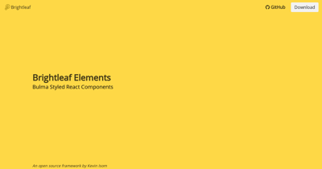

# @brightleaf/elements

React based UI elements using bulma css.

## Currently Implemented

* AutoComplete
* Box
* Breadcrumb
* Button
* Card
* Columns
* Column
* Container
* Content
* Control
* Delete
* DropDown
* Field
* Footer
* Heading
* Hero
* Icon
* Image
* Level
* MediaObject
* Menu
* Message
* Modal
* NavBar
* Notification
* Pagination
* Panel
* Section
* SubTitle
* Table
* Tabs
* Tags
* Tile
* Title

## Getting Started

```javascript
import React from 'react'
import { Hero, HeroBody, Title, SubTitle  } from '@brightleaf/elements'
import { useStyleSheet , useScript } from '@brightleaf/react-hooks'

export default () => {
  useStyleSheet(
    'https://cdnjs.cloudflare.com/ajax/libs/bulma/0.7.5/css/bulma.min.css'
  )
  useScript('https://kit.fontawesome.com/your-font-awesome-kit.js')
  return (
    <Hero isWarning>
      <HeroBody>
        <Title>Brightleaf Elements</Title>
        <SubTitle as="h4">Bulma Styled React Components</SubTitle>
      </HeroBody>
    </Hero>
  )
}
```


## More information

[Docs](https://brightleaf.github.io/elements)
[Templates](https://brightleaf.github.io/elements/templates.html)
[CodeSandbox](https://codesandbox.io/s/brightleaf-elements-hero-8fu96)